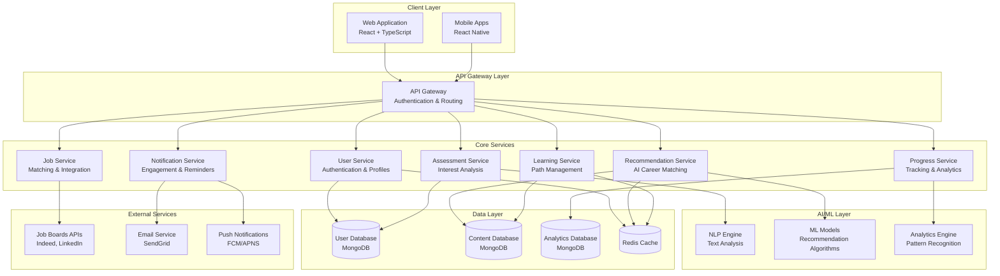

# Design Document

## Overview

AI-Sikshak is an AI-powered career mentorship platform that transforms career confusion into confident professional direction through personalized assessment, intelligent recommendations, structured learning paths, and job placement support. The system employs a microservices architecture with AI/ML components to deliver scalable, personalized career guidance across web and mobile platforms.

The platform serves as a comprehensive career development ecosystem that guides users from initial interest discovery through skill acquisition to job placement, leveraging machine learning algorithms for personalization and natural language processing for content analysis.

## Architecture

### High-Level Architecture

The system follows a microservices architecture pattern with clear separation of concerns, enabling independent scaling and deployment of different functional areas.



### Service Architecture Patterns

**API Gateway Pattern**: Single entry point for all client requests with authentication, rate limiting, and request routing.

**Database per Service**: Each microservice owns its data and database schema, ensuring loose coupling and independent scaling.

**Event-Driven Architecture**: Services communicate through events for loose coupling and eventual consistency.

**Circuit Breaker Pattern**: Fault tolerance for external service integrations and inter-service communication.

## Components and Interfaces

### User Service
**Responsibilities**: User authentication, profile management, preferences, and session handling.

**Key Interfaces**:
- `POST /api/users/register` - User registration with email verification
- `POST /api/users/login` - Authentication with JWT token generation
- `GET /api/users/profile` - Retrieve user profile and preferences
- `PUT /api/users/profile` - Update user information and settings
- `POST /api/users/reset-password` - Password reset workflow

**Dependencies**: MongoDB for user data, Redis for session caching, SendGrid for email verification.

### Assessment Service
**Responsibilities**: Interest questionnaire management, response analysis, and profile generation.

**Key Interfaces**:
- `GET /api/assessment/questionnaire` - Retrieve assessment questions
- `POST /api/assessment/responses` - Submit assessment responses
- `GET /api/assessment/profile/{userId}` - Get user's interest profile
- `POST /api/assessment/retake` - Allow assessment retaking

**AI Integration**: Natural Language Processing for response analysis, sentiment analysis for open-ended questions, and statistical modeling for interest scoring.

### Recommendation Service
**Responsibilities**: AI-powered career domain suggestions based on interest profiles and market data.

**Key Interfaces**:
- `POST /api/recommendations/generate` - Generate career recommendations
- `GET /api/recommendations/{userId}` - Retrieve user recommendations
- `POST /api/recommendations/feedback` - Collect user feedback on recommendations
- `GET /api/recommendations/domains/{domainId}` - Get detailed domain information

**ML Algorithms**: 
- Collaborative filtering for similar user patterns
- Content-based filtering using domain characteristics
- Hybrid approach combining multiple recommendation strategies
- Market demand weighting using job market data

### Learning Service
**Responsibilities**: Learning path creation, module management, and curriculum structuring.

**Key Interfaces**:
- `POST /api/learning/paths/generate` - Create personalized learning path
- `GET /api/learning/paths/{pathId}` - Retrieve learning path details
- `GET /api/learning/modules/{moduleId}` - Get module content and structure
- `PUT /api/learning/paths/{pathId}/customize` - Customize learning path based on user preferences

**Content Management**: Version-controlled learning materials, prerequisite dependency management, and adaptive path adjustment based on user progress.

### Progress Service
**Responsibilities**: Progress tracking, analytics generation, and performance monitoring.

**Key Interfaces**:
- `POST /api/progress/update` - Record learning activity completion
- `GET /api/progress/{userId}/dashboard` - Retrieve progress dashboard data
- `GET /api/progress/{userId}/analytics` - Generate detailed analytics
- `POST /api/progress/milestones` - Track milestone achievements

**Analytics Engine**: Learning velocity calculation, completion rate analysis, knowledge gap identification, and peer comparison metrics.

### Notification Service
**Responsibilities**: Automated messaging, reminder scheduling, and engagement optimization.

**Key Interfaces**:
- `POST /api/notifications/schedule` - Schedule notification delivery
- `GET /api/notifications/{userId}/preferences` - Get notification preferences
- `PUT /api/notifications/{userId}/preferences` - Update notification settings
- `POST /api/notifications/send` - Send immediate notifications

**Delivery Channels**: Email notifications, SMS reminders, push notifications for mobile apps, and in-app messaging.

### Job Service
**Responsibilities**: Job matching, application tracking, and external job board integration.

**Key Interfaces**:
- `GET /api/jobs/matches/{userId}` - Get matched job opportunities
- `POST /api/jobs/apply` - Track job applications
- `GET /api/jobs/applications/{userId}` - Retrieve application history
- `POST /api/jobs/feedback` - Collect job matching feedback

**External Integrations**: Indeed API, LinkedIn Jobs API, Glassdoor API, and company career page scraping.

## Data Models

### User Model
```typescript
interface User {
  id: string;
  email: string;
  passwordHash: string;
  profile: {
    firstName: string;
    lastName: string;
    dateOfBirth: Date;
    location: string;
    educationLevel: string;
    currentStatus: 'student' | 'graduate' | 'employed' | 'unemployed';
  };
  preferences: {
    notificationFrequency: 'daily' | 'weekly' | 'minimal';
    learningPace: 'slow' | 'moderate' | 'fast';
    careerGoals: string[];
  };
  createdAt: Date;
  updatedAt: Date;
  lastLoginAt: Date;
}
```

### Assessment Model
```typescript
interface AssessmentResponse {
  id: string;
  userId: string;
  responses: {
    questionId: string;
    answer: string | number | string[];
    responseTime: number;
  }[];
  interestProfile: {
    dimensions: {
      [key: string]: number; // Interest scores across career dimensions
    };
    confidence: number;
    completeness: number;
  };
  completedAt: Date;
  version: string; // Assessment version for tracking changes
}
```

### Learning Path Model
```typescript
interface LearningPath {
  id: string;
  userId: string;
  domainId: string;
  title: string;
  description: string;
  estimatedDuration: number; // in weeks
  difficulty: 'beginner' | 'intermediate' | 'advanced';
  modules: {
    id: string;
    title: string;
    description: string;
    prerequisites: string[];
    estimatedHours: number;
    weeklyTargets: WeeklyTarget[];
    resources: Resource[];
  }[];
  progress: {
    completedModules: string[];
    currentModule: string;
    overallProgress: number;
    weeklyTargetsMet: number;
    totalWeeklyTargets: number;
  };
  createdAt: Date;
  updatedAt: Date;
}

interface WeeklyTarget {
  id: string;
  week: number;
  title: string;
  description: string;
  tasks: string[];
  dueDate: Date;
  completed: boolean;
  completedAt?: Date;
}
```

### Job Match Model
```typescript
interface JobMatch {
  id: string;
  userId: string;
  jobId: string;
  title: string;
  company: string;
  location: string;
  description: string;
  requirements: string[];
  matchScore: number;
  skillAlignment: {
    [skill: string]: {
      required: boolean;
      userLevel: number;
      requiredLevel: number;
    };
  };
  source: 'indeed' | 'linkedin' | 'glassdoor' | 'company';
  applicationStatus?: 'not_applied' | 'applied' | 'interviewing' | 'rejected' | 'offered';
  createdAt: Date;
}
```

## Correctness Properties

*A property is a characteristic or behavior that should hold true across all valid executions of a system—essentially, a formal statement about what the system should do. Properties serve as the bridge between human-readable specifications and machine-verifiable correctness guarantees.*

Now I need to analyze the acceptance criteria to determine which ones can be tested as properties.

### Property Reflection

After analyzing all acceptance criteria, I identified several areas where properties can be consolidated to eliminate redundancy:

- **Assessment Properties**: Multiple criteria about assessment processing can be combined into comprehensive validation properties
- **Recommendation Properties**: Several criteria about recommendation generation and display can be unified
- **Progress Tracking**: Multiple progress-related criteria can be consolidated into comprehensive tracking properties
- **Notification Properties**: Various notification triggers can be combined into unified messaging properties
- **Job Matching Properties**: Multiple job-related criteria can be consolidated into comprehensive matching properties

### Converting EARS to Properties

Based on the prework analysis, here are the key correctness properties that validate our requirements:

**Property 1: Assessment Questionnaire Presentation**
*For any* new user registration, the system should present a comprehensive interest assessment questionnaire with all required questions and proper structure.
**Validates: Requirements 1.1**

**Property 2: Assessment Response Processing**
*For any* valid set of assessment responses, the Assessment Engine should analyze them using NLP and ML algorithms and produce a properly structured interest profile with quantified scores.
**Validates: Requirements 1.2, 1.3**

**Property 3: Assessment Validation**
*For any* assessment submission, the system should validate responses for completeness and consistency, rejecting invalid submissions with appropriate error messages.
**Validates: Requirements 1.4**

**Property 4: Assessment Retaking**
*For any* user requesting assessment retaking, the system should allow reassessment and generate updated results without affecting previous assessment history.
**Validates: Requirements 1.5**

**Property 5: Recommendation Generation**
*For any* completed interest assessment, the Recommendation System should generate between 3-5 career domain suggestions ranked by interest alignment and market demand.
**Validates: Requirements 2.1, 2.2**

**Property 6: Recommendation Content Completeness**
*For any* generated recommendation, the system should include detailed descriptions, salary ranges, job growth projections, and required skills for each suggested domain.
**Validates: Requirements 2.3, 2.4**

**Property 7: Learning Path Generation**
*For any* selected career domain, the system should generate a comprehensive learning path with structured modules, weekly targets, and estimated timeframes.
**Validates: Requirements 3.1, 3.2, 3.3**

**Property 8: Learning Path Prerequisites**
*For any* generated learning path, the prerequisite relationships between modules should form a valid directed acyclic graph ensuring logical progression.
**Validates: Requirements 3.4**

**Property 9: Learning Path Personalization**
*For any* two users with different skill levels selecting the same domain, the system should generate different personalized learning paths reflecting their experience differences.
**Validates: Requirements 3.5**

**Property 10: Progress Tracking Accuracy**
*For any* completed learning activity, the Progress Tracker should record the completion, update overall progress percentages, and maintain accurate completion history with timestamps.
**Validates: Requirements 4.1, 4.2, 4.5**

**Property 11: Achievement Recognition**
*For any* milestone achievement or weekly target completion, the system should celebrate accomplishments with appropriate badges or certificates and send motivational messages.
**Validates: Requirements 4.4, 5.2**

**Property 12: Notification Timing**
*For any* user with incomplete weekly targets or inactivity periods, the system should send notifications at the correct times (mid-week reminders, 3-day inactivity alerts, weekly summaries).
**Validates: Requirements 5.1, 5.3, 5.5**

**Property 13: Job Matching Threshold**
*For any* user reaching 80% learning path completion, the Job Matcher should present relevant job opportunities based on learned skills, location preferences, and experience level.
**Validates: Requirements 6.1, 6.3**

**Property 14: Job Content Integration**
*For any* job opportunity display, the system should include skill alignment indicators, readiness scores, and application tracking capabilities.
**Validates: Requirements 6.4, 6.5**

**Property 15: Cross-Platform Synchronization**
*For any* user data or progress change on one platform, the system should synchronize the changes across all other platforms (web, iOS, Android) in real-time.
**Validates: Requirements 7.3**

**Property 16: Authentication Security**
*For any* user registration or login attempt, the system should enforce secure authentication with email verification, password strength requirements, and optional OAuth integration.
**Validates: Requirements 8.1, 8.2, 8.5**

**Property 17: Analytics Generation**
*For any* user with learning activity, the system should generate detailed analytics dashboards with learning velocity, completion rates, peer comparisons, and knowledge gap identification.
**Validates: Requirements 9.1, 9.3, 9.4**

**Property 18: Content Management Validation**
*For any* learning content creation or update, the system should validate content for accuracy and completeness, track effectiveness metrics, and maintain proper version control.
**Validates: Requirements 10.2, 10.3, 10.5**

## Error Handling

### Error Categories

**Validation Errors**: Input validation failures, malformed requests, missing required fields.
- Return HTTP 400 with detailed error messages
- Provide field-specific validation feedback
- Maintain request context for debugging

**Authentication Errors**: Invalid credentials, expired tokens, insufficient permissions.
- Return HTTP 401 for authentication failures
- Return HTTP 403 for authorization failures
- Implement secure token refresh mechanisms

**Business Logic Errors**: Assessment incomplete, learning path not found, job matching failures.
- Return HTTP 422 with business-specific error codes
- Provide actionable error messages for users
- Log errors for system monitoring

**External Service Errors**: Job board API failures, email service outages, ML model unavailability.
- Implement circuit breaker patterns
- Provide graceful degradation
- Return HTTP 503 with retry-after headers

**System Errors**: Database connectivity issues, service unavailability, unexpected exceptions.
- Return HTTP 500 with generic error messages
- Log detailed error information for debugging
- Implement automatic retry mechanisms

### Error Response Format

```typescript
interface ErrorResponse {
  error: {
    code: string;
    message: string;
    details?: {
      field?: string;
      value?: any;
      constraint?: string;
    }[];
    timestamp: string;
    requestId: string;
  };
}
```

### Resilience Patterns

**Circuit Breaker**: Prevent cascading failures when external services are unavailable.

**Retry with Exponential Backoff**: Handle transient failures with intelligent retry strategies.

**Bulkhead Pattern**: Isolate critical resources to prevent system-wide failures.

**Timeout Management**: Implement appropriate timeouts for all external calls and database operations.

## Testing Strategy

### Dual Testing Approach

The AI-Sikshak platform requires both unit testing and property-based testing to ensure comprehensive coverage and correctness validation.

**Unit Tests**: Verify specific examples, edge cases, and error conditions
- Focus on individual component behavior
- Test integration points between services
- Validate error handling and edge cases
- Target 85%+ code coverage

**Property Tests**: Verify universal properties across all inputs
- Test correctness properties from the design document
- Use randomized input generation for comprehensive coverage
- Validate system behavior across wide input ranges
- Run minimum 100 iterations per property test

### Property-Based Testing Configuration

**Testing Framework**: Use `fast-check` for TypeScript/JavaScript property-based testing

**Test Configuration**:
- Minimum 100 iterations per property test
- Custom generators for domain-specific data types
- Shrinking enabled for minimal counterexample identification
- Timeout configuration for long-running tests

**Property Test Tagging**: Each property test must reference its design document property using the format:
`**Feature: ai-sikshak-platform, Property {number}: {property_text}**`

### Testing Pyramid

**Unit Tests (70%)**:
- Individual function and method testing
- Component isolation testing
- Mock external dependencies
- Fast execution (< 1 second per test)

**Integration Tests (20%)**:
- Service-to-service communication
- Database integration testing
- External API integration testing
- End-to-end workflow validation

**Property Tests (10%)**:
- Universal correctness properties
- Cross-service property validation
- Data consistency properties
- Business rule enforcement

### Test Data Management

**Test Data Generation**:
- Use factories for consistent test data creation
- Implement builders for complex object construction
- Generate realistic but anonymized test datasets
- Maintain test data isolation between test runs

**Database Testing**:
- Use in-memory databases for unit tests
- Implement database seeding for integration tests
- Ensure test data cleanup after each test
- Use transactions for test isolation

### Continuous Testing

**Pre-commit Hooks**:
- Run unit tests and linting
- Execute property tests for modified components
- Validate code coverage thresholds

**CI/CD Pipeline**:
- Full test suite execution on pull requests
- Property test execution with extended iteration counts
- Performance regression testing
- Security vulnerability scanning

**Monitoring and Alerting**:
- Test failure notifications
- Coverage regression alerts
- Property test failure analysis
- Performance degradation detection